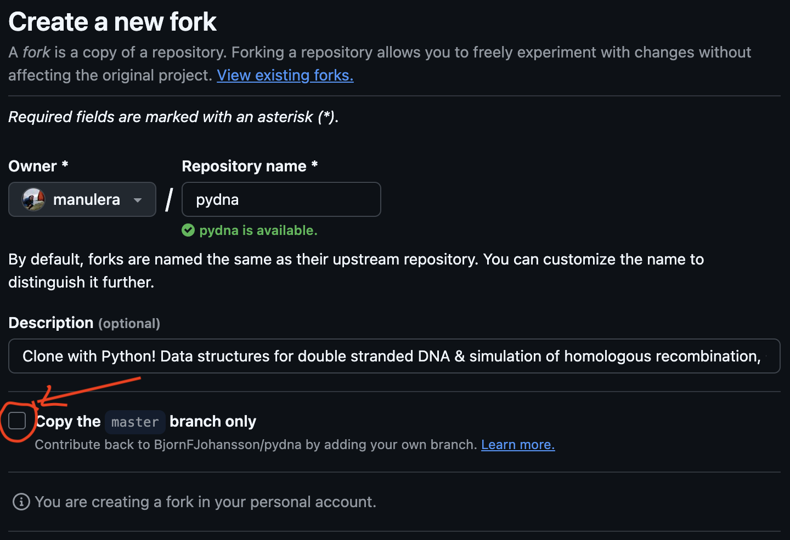

#  pydna

| [](https://github.com/BjornFJohansson/pydna/actions/workflows/pydna_test_and_coverage_workflow.yml) | [](https://codecov.io/gh/BjornFJohansson/pydna/branch/master) | [](https://badge.fury.io/py/pydna)                                                  | [](https://groups.google.com/g/pydna)              |
| -------------------------------------------------------------------------------------------------------------------------------------------------------------------------------------------------------------------------------------------------- | -------------------------------------------------------------------------------------------------------------------------------------------------- | -------------------------------------------------------------------------------------------------------------------------------------- | ------------------------------------------------------------------------------------------------------------------------------------- |
| [](https://github.com/BjornFJohansson/pydna/actions/workflows/publish-docs.yml)                                                      | [](https://github.com/BjornFJohansson/pydna/issues)                | [](https://anaconda.org/bjornfjohansson/pydna) | [](https://github.com/BjornFJohansson/pydna/stargazers) |

<!-- docs/index.rst-start -->

Pydna is a python package that provides a human-readable formal descriptions of 🧬 cloning and genetic assembly strategies in Python 🐍 for simulation and verification.
Pydna can be used as [executable documentation](https://en.wikipedia.org/wiki/Literate_programming) for cloning.

Designing genetic constructs with many components and steps, like recombinant metabolic pathways 🧫, often makes accurate documentation difficult, as seen in the poor state of scientific literature ☢️

A cloning strategy expressed in pydna is **complete**, **unambiguous** and **stable**.

Pydna provides simulation of:

- Primer design
- PCR
- Restriction digestion
- Ligation
- Gel electrophoresis of DNA with generation of gel images
- Homologous recombination
- Gibson assembly
- Golden gate assembly (in progress)


Virtually any sub-cloning experiment can be described in pydna, and its execution yield the sequences of intermediate and final DNA molecules.

Pydna has been designed with the goal of being understandable for biologists with only some basic understanding of Python.

Pydna can formalize planning and sharing of cloning strategies and is especially useful for complex or combinatorial
DNA molecule constructions.

<!-- docs/index.rst-end -->

## Acknowledgement 🤝

If you use pydna in your research, please reference the paper:

Pereira, F., Azevedo, F., Carvalho, Â., Ribeiro, G. F., Budde, M. W., & Johansson, B. (2015). Pydna: a simulation and documentation tool for DNA assembly strategies using python. BMC Bioinformatics, 16(142), 142. [doi:10.1186/s12859-015-0544-x](https://doi.org/10.1186/s12859-015-0544-x)

## Documentation and usage 📚

Full documentation of all modules and classes can be found at [https://bjornfjohansson.github.io/pydna](https://bjornfjohansson.github.io/pydna).

To get started, we recommend you to have a look at the [example notebooks](docs/notebooks). Start by having a look at [Dseq](docs/notebooks/Dseq.ipynb), [Dseq_Features](docs/notebooks/Dseq_Features.ipynb) and [Importing_Seqs](docs/notebooks/Importing_Seqs.ipynb), which cover the basics of working with sequences. The rest of the notebooks cover how to use pydna for different cloning strategies, such as Gibson assembly, Restriction-Ligation, etc.

Most pydna functionality is implemented as methods for the double stranded DNA sequence record
classes Dseq and Dseqrecord, which are subclasses of the [Biopython](http://biopython.org/wiki/Main_Page)
[Seq](http://biopython.org/wiki/Seq) and [SeqRecord](http://biopython.org/wiki/SeqRecord) classes.

These classes make PCR primer design, PCR simulation and cut-and-paste cloning very simple:

> **NOTE**: You can run this example in [this notebook](docs/notebooks/readme_example.ipynb)

```python
from pydna.dseqrecord import Dseqrecord
# Let's create a DNA sequence record, and add a feature to it
dsr = Dseqrecord("ATGCAAACAGTAATGATGGATGACATTCAAAGCACTGATTCTATTGCTGAAAAAGATAAT")
dsr.add_feature(x=0, y=60,type="gene", label="my_gene") # We add a feature to highlight the sequence as a gene
dsr.figure()
```

<pre>
Dseqrecord(-60)
<mark>ATGCAAACAGTAATGATGGATGACATTCAAAGCACTGATTCTATTGCTGAAAAAGATAAT</mark>
TACGTTTGTCATTACTACCTACTGTAAGTTTCGTGACTAAGATAACGACTTTTTCTATTA
</pre>


```python
# This is how it would look as a genbank file
print(dsr.format("genbank"))
```

    LOCUS       name                      60 bp    DNA     linear   UNK 01-JAN-1980
    DEFINITION  description.
    ACCESSION   id
    VERSION     id
    KEYWORDS    .
    SOURCE      .
      ORGANISM  .
                .
    FEATURES             Location/Qualifiers
         misc            1..60
                         /type="gene"
                         /label="my_gene"
    ORIGIN
            1 atgcaaacag taatgatgga tgacattcaa agcactgatt ctattgctga aaaagataat
    //


```python
# Now let's design primers to amplify it
from pydna.design import primer_design
# limit is the minimum length of the primer, target_tm is the desired melting temperature of the primer
amplicon = primer_design(dsr, limit=13, target_tm=55)
# Let's print the primers, and a figure that shows where they align with the template sequence
print("forward primer:", amplicon.forward_primer.seq)
print("reverse primer:", amplicon.reverse_primer.seq)
amplicon.figure()
```

```
forward primer: ATGCAAACAGTAATGATGGA
reverse primer: ATTATCTTTTTCAGCAATAGAATCA


5ATGCAAACAGTAATGATGGA...TGATTCTATTGCTGAAAAAGATAAT3
                        |||||||||||||||||||||||||
                        3ACTAAGATAACGACTTTTTCTATTA5
5ATGCAAACAGTAATGATGGA3
    ||||||||||||||||||||
3TACGTTTGTCATTACTACCT...ACTAAGATAACGACTTTTTCTATTA5
```


```python
# Let's say we don't want to just amplify it, but we want to add restriction sites to it!
from pydna.amplify import pcr
# We add the restriction sites to the primers
forward_primer = "ccccGGATCC" + amplicon.forward_primer
reverse_primer = "ttttGGATCC" + amplicon.reverse_primer

# We do the PCR
pcr_product = pcr(forward_primer, reverse_primer, dsr)
# The PCR product is of class `Amplicon`, a subclass of `Dseqrecord`.
# When doing a figure, it shows where primers anneal.
pcr_product.figure()
```

```
            5ATGCAAACAGTAATGATGGA...TGATTCTATTGCTGAAAAAGATAAT3
                                    |||||||||||||||||||||||||
                                    3ACTAAGATAACGACTTTTTCTATTACCTAGGtttt5
5ccccGGATCCATGCAAACAGTAATGATGGA3
            ||||||||||||||||||||
            3TACGTTTGTCATTACTACCT...ACTAAGATAACGACTTTTTCTATTA5
```

```python
# If we want to see the sequence more clearly, we can turn it into a `Dseqrecord`
pcr_product = Dseqrecord(pcr_product)
pcr_product.figure()
```

<pre>
Dseqrecord(-80)
ccccGGATCC<mark>ATGCAAACAGTAATGATGGATGACATTCAAAGCACTGATTCTATTGCTGAAAAAGATAAT</mark>GGATCCaaaa
ggggCCTAGGTACGTTTGTCATTACTACCTACTGTAAGTTTCGTGACTAAGATAACGACTTTTTCTATTACCTAGGtttt
</pre>


```python
from Bio.Restriction import BamHI # cuts GGATCC
# a, payload, c are the cut fragments
a, payload, c = pcr_product.cut (BamHI)
print(a.figure())
print()
print (payload.figure())
print()
print(c.figure())
```

<pre>
Dseqrecord(-9)
ccccG
ggggCCTAG

Dseqrecord(-70)
GATCC<mark>ATGCAAACAGTAATGATGGATGACATTCAAAGCACTGATTCTATTGCTGAAAAAGATAAT</mark>G
    GTACGTTTGTCATTACTACCTACTGTAAGTTTCGTGACTAAGATAACGACTTTTTCTATTACCTAG

Dseqrecord(-9)
GATCCaaaa
    Gtttt
</pre>

```python
# We create a circular vector to insert the amplicon into
vector = Dseqrecord("aatgtttttccctCCCGGGcaaaatAGATCTtgctatgcatcatcgatct", circular=True, name="vect")
vector.figure()
```


```
Dseqrecord(o50)
aatgtttttccctCCCGGGcaaaatAGATCTtgctatgcatcatcgatct
ttacaaaaagggaGGGCCCgttttaTCTAGAacgatacgtagtagctaga
```


```python
from Bio.Restriction import BglII # cuts AGATCT
linear_vector_bgl = vector.cut(BglII)[0] # Linearize the vector at BglII (produces only one fragment)

# Ligate the fragment of interest to the vector, and call looped() to circularize it
# synced is used to place the origin coordinate (0) in the same place for rec_vector and vector
rec_vector= (linear_vector_bgl + payload).looped().synced(vector)
rec_vector.figure()

```

<pre>
Dseqrecord(o116)
aatgtttttccctCCCGGGcaaaatAGATCC<mark>ATGCAAACAGTAATGATGGATGACATTCAAAGCACTGATTCTATTGCTGAAAAAGATAAT</mark>GGATCTtgctatgcatcatcgatct
ttacaaaaagggaGGGCCCgttttaTCTAGGTACGTTTGTCATTACTACCTACTGTAAGTTTCGTGACTAAGATAACGACTTTTTCTATTACCTAGAacgatacgtagtagctaga
</pre>


```python
# Let's simulate a Gibson assembly
from pydna.assembly import Assembly

fragments = [
    Dseqrecord('aatgtttttccctCACTACGtgctatgcatcat', name="fragment_A"),
    Dseqrecord('tgctatgcatcatCTATGGAcactctaataatg', name="fragment_B"),
    Dseqrecord('cactctaataatgTTACATAaatgtttttccct', name="fragment_C"),
]

# limit is the min. homology length between fragments in the assembly
asm = Assembly(fragments, limit=10)

# From the assembly object, which can generate all possible products, get a circular
product, *rest = asm.assemble_circular()

# We can print a figure that shows the overlaps between fragments
product.figure()

```
     -|fragment_A|13
    |             \/
    |             /\
    |             13|fragment_B|13
    |                           \/
    |                           /\
    |                           13|fragment_C|13
    |                                         \/
    |                                         /\
    |                                         13-
    |                                            |
     --------------------------------------------

```python
# Or show the final sequence:
Dseqrecord(product).figure()

```

```
Dseqrecord(o60)
aatgtttttccctCACTACGtgctatgcatcatCTATGGAcactctaataatgTTACATA
ttacaaaaagggaGTGATGCacgatacgtagtaGATACCTgtgagattattacAATGTAT
```


As the example above shows, pydna keeps track of sticky ends and features.

Pydna can be very compact. The eleven lines of Python below simulates the construction of a recombinant plasmid.
DNA sequences are downloaded from Genbank by accession numbers that are guaranteed to be stable over time.

```python
from pydna.genbank import Genbank
gb = Genbank("myself@email.com") # Tell Genbank who you are!
gene = gb.nucleotide("X06997") # Kluyveromyces lactis LAC12 gene for lactose permease.
from pydna.parsers import parse_primers
primer_f,primer_r = parse_primers(''' >760_KlLAC12_rv (20-mer)
                                        ttaaacagattctgcctctg

                                        >759_KlLAC12_fw (19-mer)
                                        aaatggcagatcattcgag ''')

from pydna.amplify import pcr
pcr_prod = pcr(primer_f,primer_r, gene)
vector = gb.nucleotide("AJ001614") # pCAPs cloning vector
from Bio.Restriction import EcoRV
lin_vector = vector.linearize(EcoRV)
rec_vec =  ( lin_vector + pcr_prod ).looped()
```

## Installation 📦

<!-- docs/installation.rst-start -->

By default, pydna is installed with minimal dependencies, but there are optional dependencies for additional functionality.


### Optional dependencies
<details>
<summary>Click here to see optional dependencies</summary>

<!-- I did not make these headers because they mess up the sphinx docs by being inside of a collapsible section-->

_________________

**clipboard**

Enables the `pydna.dseqrecord.Dseqrecord.copy_gb_to_clipboard()` and `pydna.dseqrecord.Dseqrecord.copy_fasta_to_clipboard()`

These methods will put a copy the sequence on the clipboard in either Genbank (gb) or fasta format.


| Dependency                                          | Function in pydna          |
| --------------------------------------------------- | -------------------------- |
| [pyperclip](https://pypi.python.org/pypi/pyperclip) | copy sequence to clipboard |

_________________

**download**

Pyparsing enables the `pydna.genbankfixer.gbtext_clean()` function that can automatically
correct malformed sequence files in Genbank format. These are often found online, so this
option also installs requests to enable the  `pydna.genbankfixer.download.download_text()` function which can be used to get cleaned up text from a URL.


| Dependency                                          | Function in pydna                                 |
| --------------------------------------------------- | ------------------------------------------------- |
| [pyparsing](https://pypi.python.org/pypi/pyparsing) | fix corrupt Genbank files with pydna.genbankfixer |
| [requests](https://pypi.org/project/requests)       | download sequences with pydna.download            |

_________________

**express**

This option enables the `pydna.utils.cai()` function and the `cai()` method
available from subclasses of `pydna.seqrecord.SeqRecord`, such as
`pydna.dseqrecord.Dseqrecord`.

| [cai2](https://pypi.python.org/pypi/cai2)           | codon adaptation index calculations in several modules |

_________________

**gel**

Scipy, matplotlib and pillow (PIL) enable the generation of gel images. Numpy is also
needed, but usually installed as a dependency of biopython.


| Dependency                                        | Function in pydna             |
| ------------------------------------------------- | ----------------------------- |
| [scipy](https://www.scipy.org)                    | gel simulation with pydna.gel |
| [matplotlib](http://matplotlib.org)               | “                             |
| [pillow](https://github.com/python-pillow/Pillow) | “                             |

_________________

</details>

### Installing with pip 🐍

```bash
# use the `--pre` flag to get the latest version of pydna.
pip install --pre --upgrade pydna

# to install the optional dependencies, you can use the following command:
pip install --pre --upgrade pydna[clipboard,download,express,gel]
```

Remove options inside the square brackets as required, but be sure not to leave spaces as pip will not recognize the options. See below under "Optional dependencies".

### Installing with poetry 🧙‍♂️

If your project uses [poetry](https://python-poetry.org/) to manage dependencies, you can install pydna with the following commands:

```bash
# Basic installation
poetry add pydna
# With optional dependencies (ommit the options you don't want)
poetry add pydna --extras "clipboard download express gel"

# If you already have it installed and you want to add or remove optional
# dependencies, you have to uninstall and install again
poetry remove pydna
poetry add pydna --extras "express gel"
```

<!-- docs/installation.rst-end -->

## Contributing and feedback 🛠️

Feedback & suggestions are very welcome! Please create an issue with your question, comment or suggestion. Please include the version of pydna you are using and code to reproduce the issue if possible.

If you don't have a github account, you can get in touch through the [google group](https://groups.google.com/d/forum/pydna) for pydna.

Below are the instructions for developers who want to contribute to pydna. Please direct pull requests towards the `dev_bjorn` branch.

### Fork the repository and set up a dev branch 🍴

Fork the entire repository (not just the `master` branch by unticking the "Copy the `master` branch only" box)



Create your branch starting from `dev_bjorn`, and if your changes are related to an issue, call the branch `issue_<number>`.

```bash
# Clone the repository
git clone https://github.com/<your-username>/pydna.git

# Change to the repository directory
cd pydna

# Go to the dev_bjorn branch
git checkout -b dev_bjorn

# Pull the current version of dev_bjorn
git pull origin dev_bjorn

# Create your own branch
git checkout -b issue_<number>
```

### Local development 💻

#### Preferred method (using `poetry`) 🧙‍♂️

This is the preferred method to develop on pydna, so if you plan to contribute regularly, it's worth taking this route. If you
encounter any issues setting up the dev environment, create an issue on GitHub and we will be able to help.

Use [Poetry](https://python-poetry.org/docs/#installation) to install dependencies and activate virtual environment. This is necessary
if you want to edit the project dependencies. Install poetry using [pipx](https://github.com/pypa/pipx) following poetry's installation instructions, do not install it
in the system python or the project environment.

```bash
# If you want the virtual environment to be created in this folder
# (this is now the default, see `poetry.toml`)
poetry config virtualenvs.in-project true

# Install dependencies (extras are required for tests to pass)
poetry install --all-extras

# Activate virtual environment
poetry shell

# Install pre-commit hooks
poetry run pre-commit install
```

#### Alternative method (using `pip`) 🐍

Use this for a small contribution or if you don't manage to set up the dev environment.

```bash
# Create a new virtual environment
python -m venv .venv

# Activate the virtual environment
source .venv/bin/activate

# Install all dependencies (library deps + dev and test requirements)
pip install -r requirements.txt

# Install the project as editable dependency
pip install -e .

# Install the pre-commit hooks
pre-commit install
```

#### Contributing code 💻

1. Make your changes.
2. Add the necessary tests in `tests/`.
3. Run the tests from the root directory with `python run_test.py`.
   > **TIP:** You can run a particular test file with `pytest -vs test_file.py` (`-v` for verbose and `-s` to see print statements in the test). If you want to run just a single test, you can use `pytest -vs -k test_name`, where `test_name` is the name of the test function.
4. Before committing, install `pre-commit` hooks if you haven't by running `pre-commit install`. `pre-commit` should be available in the environment regardless of the method you use to set up the dev environment.
   > **TIP:** The hooks are a series of checks that will be run before you commit your code. If any of the checks fail, the commit will not be allowed. Some of them auto-fix the code (e.g., `black` formatting), so you can simply do `git add .` and commit again. Others like `flake8` will prevent the commit to happen until the code is compliant.  For instance, if you import a module in a file and not use it, `flake8` will complain. For a full list of checks, see `.pre-commit-config.yaml`.
5. Push the changes to your fork

### Creating a PR 🔗

 * From your fork, make a PR towards the branch `dev_bjorn` in the original repository.
 * Mention the issue number in the PR description (e.g., `Closes #123`).
 * Remember to click the "Allow edits from maintainers" checkbox so that we can make some changes to the PR if necessary.

### Continuous integration 🤖

The test_and_coverage workflow is triggered on all pushed commits for all branches except the `master` branch. This workflow run tests, doctests and a series of Jupyter notebooks using pytest on Linux, Windows and macOS with all
supported python versions.

### Building the documentation locally 📚

Documentation is built using [Sphinx](http://www.sphinx-doc.org/) from [docstrings](https://www.python.org/dev/peps/pep-0257/)
using a GitHub [action](https://github.com/BjornFJohansson/pydna/actions/workflows/publish-docs.yml).
The [numpy](https://www.numpy.org) [docstring format](https://numpy.org/doc/stable/dev/howto-docs.html#docstring-intro) is used.

Below the commands to run a local sphinx server that auto-updated when files are changed.

```bash
# Install docs dependency group
poetry install --with docs

# Start the sphinx server to see docs live by default at http://127.0.0.1:8000/
sphinx-autobuild --watch src/ docs docs/_build/html

```

More info about how to contribute to the documentation can be found [here](docs/README.md)

## Release process 🚀

See the [releases](https://github.com/BjornFJohansson/pydna/releases) for changes and releases.

The build workflow builds a PyPI packages using poetry. This workflow is triggered by publishing a Github release manually from the Github web interface.


## History 📜

Pydna was made public in 2012 on [Google code](https://code.google.com/archive/p/pydna).

:microbe:

:portugal:

## Who is using pydna? 🧪

Taylor, L. J., & Strebel, K. (2017).
Pyviko: an automated Python tool to design gene knockouts in complex viruses with overlapping genes.
BMC Microbiology, 17(1), 12.
[PubMed](https://www.ncbi.nlm.nih.gov/pubmed/28061810)

Wang, Y., Xue, H., Pourcel, C., Du, Y., & Gautheret, D. (2021).
2-kupl: mapping-free variant detection from DNA-seq data of matched samples.
In Cold Spring Harbor Laboratory (p. 2021.01.17.427048). [DOI](https://doi.org/10.1101/2021.01.17.427048)
[PubMed](https://www.ncbi.nlm.nih.gov/pmc/articles/PMC8180056)

[ShareYourCloning](https://shareyourcloning.org), a web application for designing and documenting DNA cloning strategies.

[An Automated Protein Synthesis Pipeline with Transcriptic and Snakemake](http://blog.booleanbiotech.com/transcriptic_protein_synthesis_pipeline.html)

and other projects on [github](https://github.com/BjornFJohansson/pydna/network/dependents?package_id=UGFja2FnZS01MjQ2MjYzNQ%3D%3D)
